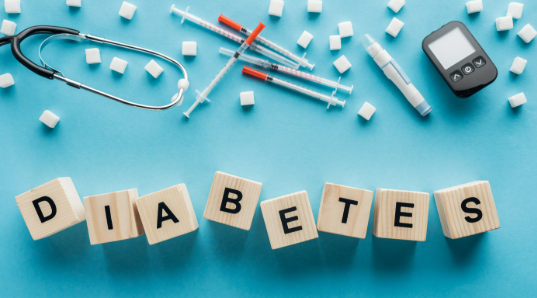

# 🩺 Diabetes Prediction App

A machine learning web application built using **Streamlit** that predicts whether a person is diabetic based on medical features. This app uses both **Logistic Regression** and **Random Forest Classifier** models trained on the well-known *Pima Indians Diabetes Dataset*.



---

## 📊 Features

- 📁 Upload and preview dataset
- 📈 Perform Exploratory Data Analysis (EDA)
  - Count plots for binned data
  - Correlation heatmap
  - Distribution plots
- 🧠 Predict diabetes using:
  - Logistic Regression
  - Random Forest Classifier
- 🧪 Visualize test predictions with graphs
- ✅ Save and use trained models with `.pkl` files
- ⚙️ Scaled for cloud deployment via Streamlit Cloud

---

## 🧠 Machine Learning Models Used

| Model               | Description                             |
|--------------------|-----------------------------------------|
| Logistic Regression| A simple and interpretable linear model |
| Random Forest      | An ensemble of decision trees offering high performance |

Models are trained in `main.ipynb` and saved using `joblib`.

---

## 📁 Project Structure

```
.
├── app.py                  # Streamlit application
├── main.ipynb              # Jupyter notebook with EDA + model training
├── kaggle_diabetes.csv     # Dataset used in training
├── log_model.pkl           # Trained logistic regression model
├── rf_model.pkl            # Trained random forest model
├── scaler.pkl              # StandardScaler used for prediction
├── test_data.pkl           # Pickled X_test used for plotting test results
├── requirements.txt        # Python dependencies for Streamlit deployment
├── img.png                 # Screenshot of the deployed app
├── saved_graphs/           # Folder containing generated plots
├── LICENSE                 # MIT License
└── README.md               # This file
```

---

## 🚀 Deployment (Streamlit Cloud)

To deploy this project on **Streamlit Cloud**:

1. Fork or clone this repository.
2. Sign in to [Streamlit Cloud](https://streamlit.io/cloud).
3. Create a new app and connect this GitHub repo.
4. Set `app.py` as the main file.
5. Make sure all `.pkl` and `.csv` files are at the root level.
6. Streamlit will automatically install dependencies from `requirements.txt`.

✅ The app will be live on a shareable URL like: `https://your-username.streamlit.app`

---

## 🛠️ Local Setup Instructions

To run the app locally on your machine:

1. Clone the repository:

```bash
git clone https://github.com/your-username/diabetes-prediction-app.git
cd diabetes-prediction-app
```

2. Create a virtual environment and install dependencies:

```bash
pip install -r requirements.txt
```

3. Launch the Streamlit app:

```bash
streamlit run app.py
```

---

## 📥 Input Features Used for Prediction

The model uses the following 8 features from the dataset:

- `Pregnancies`
- `Glucose`
- `BloodPressure`
- `SkinThickness`
- `Insulin`
- `BMI`
- `DiabetesPedigreeFunction`
- `Age`

Users can enter these values manually in the app for prediction.

---

## 📊 Model Evaluation Metrics

Each model is evaluated using:

- ✅ Accuracy Score
- 🧮 Confusion Matrix
- 📃 Classification Report (Precision, Recall, F1-score)
- 📉 Visual performance charts for comparison

Model performance graphs are saved to the `saved_graphs/` folder.

---


## 🤖 Future Improvements

- Add additional models like XGBoost or SVM
- Enable user-uploaded custom datasets
- Store prediction history for session-based analysis
- Add SHAP or LIME interpretability features
- Expand into a full health diagnostic dashboard

---


## 📝 License

This project is licensed under the **MIT License** - see the [LICENSE](LICENSE) file for details.

---

## 🙋‍♀️ Acknowledgements

- [Streamlit](https://streamlit.io/)
- [scikit-learn](https://scikit-learn.org/)
- [Pandas](https://pandas.pydata.org/)
- [Matplotlib](https://matplotlib.org/)
- [Seaborn](https://seaborn.pydata.org/)
- [Kaggle](https://www.kaggle.com/)

---

## 👨‍💻 Developed By

**Muqnit Ur Rehman**  
[GitHub](https://github.com/muqniturrehman) • [LinkedIn](https://www.linkedin.com/in/muqnit-ur-rehman-1a5b492b0) • [Kaggle](https://www.kaggle.com/muqniturrehman) • [Email] (mailto:muqniturrehman@gmail.com) 
